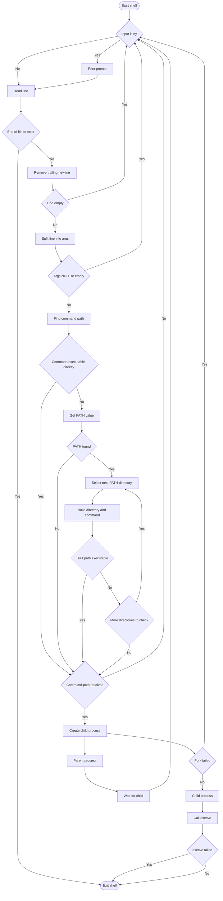

# C - Simple Shell - Holberton School

# simple_shell

## Table of Contents
- [General Behavior](https://github.com/v-lmb/holbertonschool-simple_shell/edit/dev/README.md#general-behavior)
- [Project Structure](https://github.com/v-lmb/holbertonschool-simple_shell/edit/dev/README.md#project-structure)
- [Flowchart](https://github.com/v-lmb/holbertonschool-simple_shell/edit/dev/README.md#flowchart)
- [Prerequisites](https://github.com/v-lmb/holbertonschool-simple_shell/edit/dev/README.md#prerequisites)
- [Installation & Execution](https://github.com/v-lmb/holbertonschool-simple_shell/edit/dev/README.md#installation--execution)
- [Compilation](https://github.com/v-lmb/holbertonschool-simple_shell/edit/dev/README.md#compilation)
- [Usage](https://github.com/v-lmb/holbertonschool-simple_shell/edit/dev/README.md#usage)
- [Technologies used](https://github.com/v-lmb/holbertonschool-simple_shell/edit/dev/README.md#technologies-used)
- [Authors](https://github.com/v-lmb/holbertonschool-simple_shell/edit/dev/README.md#authors)
- [Specials thanks](https://github.com/v-lmb/holbertonschool-simple_shell/edit/dev/README.md#specials-thanks-to)
- [Version History](https://github.com/v-lmb/holbertonschool-simple_shell/edit/dev/README.md#version-history)
- [Licence](https://github.com/v-lmb/holbertonschool-simple_shell/edit/dev/README.md#license)

---

## About

This project is a simplified implementation of a UNIX shell, developed as part of the Holberton School curriculum. It replicates the basic functionality of a command interpreter such as /bin/sh, allowing you to execute commands, manage processes, and navigate the file system.
The shell supports both interactive mode (where the user types commands) and non-interactive mode (where commands are passed via a pipe or file).
Learning objectives

This project provides an understanding of :
- The internal workings of a UNIX shell
- Process creation and management (fork, exec, wait)
- Manipulating the system environment
- Dynamic memory management in C
- String parsing
- Searching for commands in the PATH

### List of allowed functions and system calls+

all functions from ```string.h```
- ```access``` (man 2 access)
- ```chdir``` (man 2 chdir)
- ```close``` (man 2 close)
- ```closedir``` (man 3 closedir)
- ```execve``` (man 2 execve)
- ```exit``` (man 3 exit)
- ```_exit``` (man 2 _exit)
- ```fflush``` (man 3 fflush)
- ```fork``` (man 2 fork)
- ```free``` (man 3 free)
- ```getcwd``` (man 3 getcwd)
- ```getline``` (man 3 getline)
- ```getpid``` (man 2 getpid)
- ```isatty``` (man 3 isatty)
- ```kill``` (man 2 kill)
- ```malloc``` (man 3 malloc)
- ```open``` (man 2 open)
- ```opendir``` (man 3 opendir)
- ```perror``` (man 3 perror)
- ```printf``` (man 3 printf)
- ```fprintf``` (man 3 fprintf)
- ```vfprintf``` (man 3 vfprintf)
- ```sprintf``` (man 3 sprintf)
- ```putchar``` (man 3 putchar)
- ```read``` (man 2 read)
- ```readdir``` (man 3 readdir)
- ```signal``` (man 2 signal)
- ```stat``` (__xstat) (man 2 stat)
- ```lstat``` (__lxstat) (man 2 lstat)
- ```fstat``` (__fxstat) (man 2 fstat)
- ```strtok``` (man 3 strtok)
- ```wait``` (man 2 wait)
- ```waitpid``` (man 2 waitpid)
- ```wait3``` (man 2 wait3)
- ```wait4``` (man 2 wait4)
- ```write``` (man 2 write)

### Files

| File | Description |
| --- | --- |
| AUTHORS | List of contributors |
| README.md | This file |
| build_path.c | Building full path |
| execute_command.c | Command execution |
| find_command_in_path.c | Searching the PATH |
| get_path.c | Extrating the Path variable |
| hsh | Executable |
| main.h | Main header |
| shell.c | Main function and shell loop |
| split.c | Parsing arguments |

---

## Project Structure
```
holberton-simple_shell/
│
├── AUTHORS
├── README.MD
├── build_path.c
├── execute_command.c
├── find_command_in_path.c
├── get_path.c
├── hsh
├── main.h
├── shell.c
└── split.c
```

---

## Flowchart




---

## Prerequisites

* GCC compiler (GNU89)
* Linux environment (recommended)
* Git

---

## Installation & Execution

1. Open your terminal
2. Navigate to the desired directory
3. Clone the repository:

```bash
git clone https://github.com/v-lmb/holbertonschool-simple_shell.git
```

4. Move into the project directory:

```bash
cd holbertonschool-simple_shell
```

5. Run the program:
```bash
./hsh
```

---

## Compilation

Compile the shell using:

```bash
gcc -Wall -Werror -Wextra -pedantic -std=gnu89 *.c -o hsh
```

---

## Usage

### Interactive mode

```bash
$ ./hsh
($) /bin/ls
hsh main.c shell.c
($) exit
$
```

### Non-interactive mode

```bash
$ echo "/bin/ls" | ./hsh
hsh main.c shell.c
```

---

## Documentation
The complete man page can be found in the file:

---

## Technologies Used

<div align="left">
  
  
  
  
  
  
  
</div>

---

## Authors

* **[Véronique Beauvais](https://github.com/Veroniquebvs)**
* **[Virginie Lombarte](https://github.com/v-lmb)**

---

## Specials thanks to

* **Véronique BEAUVAIS a fabulous team mate**
* **Sofian a very patient and helpful SWE**

---

## Version History

* **v1.0** — Initial release

---

## License

This project is licensed under the **GNU GPL v3.0**.
See the `LICENSE` file for more details.
